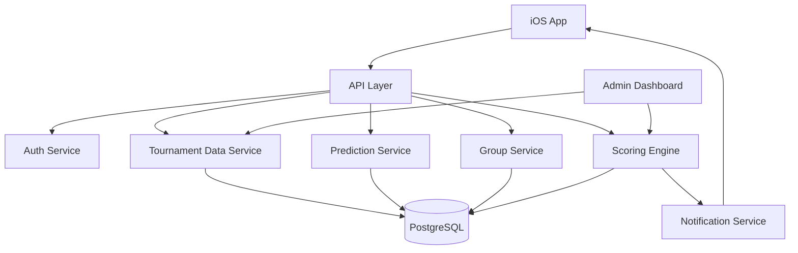

# World Cup Bracket App Plan

## Product Summary

Build a native iOS app for World Cup bracket pools. Users sign in with Apple, join groups, make predictions across two tournament phases, and compete on leaderboards using a scoring system tailored to the 2026 World Cup format.

The app should feel similar to an NCAA March Madness pool, but adapted for the World Cup's expanded structure:

- 48 teams
- 12 groups of 4
- Top 2 teams from each group advance
- 8 best third-place teams advance
- 32-team knockout stage

Because the knockout matchups depend heavily on group-stage results, the product should use a two-phase prediction model instead of requiring one full pre-tournament bracket.

## Product Direction

### Phase 1: Group Stage Picks

Users predict which teams will advance from the group stage.

Core picks:

- Group winner
- Group runner-up
- Third-place finisher
- Whether the third-place team advances

Optional future picks:

- Exact 1 through 4 group order
- Match score predictions
- Group points totals
- Goal difference tiebreaker predictions

Lock behavior:

- For MVP, lock all group-stage picks before the tournament begins.
- Later, consider group-by-group locking before each group's first match.
- Avoid allowing users to edit a group after that group has started.

### Phase 2: Knockout Bracket

Once the official Round of 32 field is known, users create a traditional knockout bracket.

Picks:

- Round of 32 winners
- Round of 16 winners
- Quarterfinal winners
- Semifinal winners
- Final winner
- Champion
- Optional third-place match winner

Recommended lock behavior:

- Knockout brackets lock before the first Round of 32 match.
- Knockout-only late entry is supported through a separate group type.
- Knockout-only groups can be created after the group stage ends and before the knockout stage begins.

## Core User Journeys

### 1. Onboarding

1. User opens the app.
2. User signs in with Apple.
3. User creates a display name.
4. User optionally selects a favorite team.
5. User lands on a dashboard showing active pools, tournament status, and open prediction windows.

### 2. Create Group

1. User creates a group.
2. User names the group.
3. User chooses scoring settings.
4. User chooses whether the group supports:
   - Group-stage pool only
   - Knockout pool only
   - Full tournament pool
5. App generates an invite link and invite code.

### 3. Join Group

1. User opens an invite link or enters a code.
2. User previews group settings.
3. User joins the group.
4. User submits eligible predictions based on the current phase.

### 4. Submit Group-Stage Picks

1. User opens the group-stage prediction flow.
2. User reviews each World Cup group.
3. User selects expected winner, runner-up, and third-place finisher.
4. User marks whether the third-place team advances.
5. User reviews all picks.
6. User submits before lock.

### 5. Submit Knockout Bracket

1. User receives notification that knockout brackets are open.
2. User opens the Round of 32 bracket.
3. User advances teams round by round.
4. User picks a champion.
5. User reviews and submits before lock.

### 6. Track Results

1. User views live leaderboard standings.
2. User sees their correct picks, missed picks, and possible remaining points.
3. User can compare brackets with other group members after lock.
4. User receives push notifications for major scoring updates.

## Feature Scope

### MVP

- Native iOS app built with SwiftUI
- Sign in with Apple
- User profile and display name
- Tournament data model
- Group-stage prediction flow
- Knockout bracket prediction flow
- Private groups with invite codes or links
- Bracket submission locking
- Default scoring system
- Group leaderboards
- Sports data provider integration for match results
- Admin fallback for result correction and rescoring

### Strong V1

- Push notifications
- Public groups
- Multiple entries per user, configurable by group
- Separate and combined leaderboards
- Max possible points calculation
- Bracket comparison views
- Shareable bracket image
- Admin dashboard for tournament data and results

### Later

- Advanced score prediction mode
- Custom group scoring rules
- Apple widgets
- Live Activities
- In-app group chat or reactions
- Paid pools, subject to legal and compliance review
- Web viewer for shared brackets

## Scoring Model

The app should score group-stage picks and knockout picks separately, then combine them for full-tournament groups.

Recommended default scoring:

| Pick                                   | Points |
| -------------------------------------- | -----: |
| Correct group winner                   |      4 |
| Correct group runner-up                |      3 |
| Correct third-place team               |      2 |
| Correct third-place advancement result |      2 |
| Perfect group top 3 bonus              |      3 |
| Correct Round of 32 winner             |      4 |
| Correct Round of 16 winner             |      6 |
| Correct quarterfinal winner            |      8 |
| Correct semifinal winner               |     12 |
| Correct champion                       |     20 |

Post-MVP scoring settings:

- Third-place match winner
- Exact group order bonus
- Underdog bonus
- Correct finalist bonus
- Perfect knockout round bonus
- Exact score bonus for advanced mode

Design principle:

Group-stage picks should matter, but the knockout bracket and champion pick should remain the emotional center of the competition.

## High-Level Technical Design

### iOS App

Recommended stack:

- SwiftUI
- Swift Concurrency with async/await
- Sign in with Apple via AuthenticationServices
- URLSession or a lightweight API client layer
- Local caching for tournament data and submitted predictions
- APNs for push notifications

Suggested app modules:

- Auth
- Dashboard
- Groups
- GroupStagePredictions
- KnockoutBracket
- Leaderboards
- Profile
- TournamentData

### Backend

Recommended direction:

- PostgreSQL-backed backend
- REST or GraphQL API
- Server-side scoring engine
- Admin-only result entry tooling

Good implementation options:

- Supabase plus edge functions for fast MVP
- Custom API using Node.js, Rails, Go, or Swift Vapor

The data model is relational, so PostgreSQL is a strong fit.

### Core Data Models

#### User

- id
- appleUserIdentifier
- displayName
- favoriteTeamId
- createdAt

#### Team

- id
- name
- countryCode
- fifaCode
- groupId
- seed

#### Tournament

- id
- name
- year
- startsAt
- groupStageLockAt
- knockoutLockAt

#### Group

- id
- tournamentId
- name

#### Match

- id
- tournamentId
- phase
- groupId
- homeTeamId
- awayTeamId
- startsAt
- homeScore
- awayScore
- winnerTeamId
- status

#### PoolGroup

- id
- name
- ownerUserId
- inviteCode
- scoringRuleSetId
- poolType
- maxEntriesPerUser
- createdAt

#### GroupMembership

- id
- poolGroupId
- userId
- role
- joinedAt

#### TournamentEntry

- id
- poolGroupId
- userId
- name
- createdAt

Represents a user's overall competition entry inside a group.

#### GroupStagePrediction

- id
- tournamentEntryId
- groupId
- predictedWinnerTeamId
- predictedRunnerUpTeamId
- predictedThirdPlaceTeamId
- predictedThirdPlaceAdvances
- submittedAt
- lockedAt

#### KnockoutBracketPrediction

- id
- tournamentEntryId
- submittedAt
- lockedAt

#### KnockoutPick

- id
- knockoutBracketPredictionId
- matchId
- pickedWinnerTeamId

#### ScoringRuleSet

- id
- name
- rulesJson

#### ScoreEvent

- id
- tournamentEntryId
- sourceType
- sourceId
- points
- reason
- createdAt

#### LeaderboardEntry

Can be computed dynamically or cached.

- poolGroupId
- tournamentEntryId
- groupStagePoints
- knockoutPoints
- totalPoints
- maxPossiblePoints
- rank

## Backend Services

### Auth Service

- Validates Sign in with Apple credentials.
- Creates or updates users.
- Issues app session tokens.

### Tournament Data Service

- Stores teams, groups, fixtures, and match results.
- Publishes tournament phase status.
- Supplies bracket structure to the app.

### Prediction Service

- Validates picks.
- Enforces lock rules.
- Stores group-stage and knockout predictions.

### Group Service

- Creates groups.
- Manages invite links and invite codes.
- Handles membership and roles.

### Scoring Engine

- Evaluates predictions against official results.
- Emits score events.
- Recalculates leaderboards.
- Computes max possible points.

### Notification Service

- Sends push notifications when:
  - Prediction windows open
  - Prediction windows are about to close
  - Knockout bracket opens
  - Leaderboards update
  - A user's champion is eliminated

### Admin Service

- Allows trusted admins to:
  - Update match results
  - Open and close phases
  - Fix tournament data
  - Trigger rescoring

## Architecture Sketch

## Product Decisions

These decisions are accepted for MVP:

1. Group-stage picks lock before the tournament.
2. MVP supports exact group order.
3. Users can submit one entry per pool.
4. Groups use one default scoring system.
5. Match results come from a sports data provider, with admin fallback for corrections.
6. Knockout-only late entry is a separate group type that can be created after the group stage ends and before the knockout stage begins.

Open follow-up decisions:

1. Which sports data provider should we use?
2. What should the app and product name be?
3. Should the app support iPad in MVP, or iPhone only?
4. Should groups be private-only for MVP?
5. Should the backend be Supabase-first or custom API-first?

## Recommended Build Order

1. Define tournament data schema.
2. Build scoring engine in isolation with tests.
3. Prototype group-stage prediction UX.
4. Prototype knockout bracket UX.
5. Add Sign in with Apple.
6. Add private groups and invite codes.
7. Add prediction submission and lock rules.
8. Add leaderboard calculations.
9. Add sports data provider ingestion.
10. Add admin result correction and rescoring.
11. Polish app navigation, states, and sharing.

## MVP Success Criteria

- A user can sign in with Apple.
- A user can create or join a private group.
- A user can submit group-stage predictions before lock.
- A user can submit knockout predictions once the knockout phase opens.
- The app can score predictions from provider-supplied results.
- Admins can correct result data and trigger rescoring.
- A group leaderboard accurately reflects group-stage points, knockout points, and total points.
- Users can clearly understand what is open, locked, correct, incorrect, and still possible.
